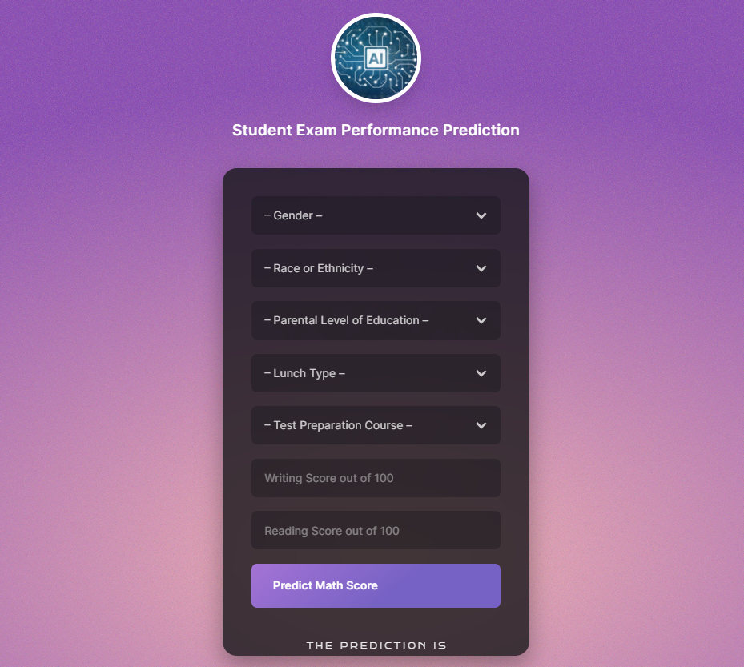

# Match Score Prediction Model

This repository contains code for a machine learning model that predicts the likelihood of a math score based on various metrics. The model is trained on a dataset containing information about students, including factors such as `gender`, `writing score`, `reading score`, etc.

## Dataset

The dataset used for training the model is stored in the `artifacts` directory. It is a CSV file named `data.csv` containing information about students.

## Setup

To set up the environment for running the model, follow these steps:

1. Clone the repository: `git clone https://github.com/rydercodes/mlproject.git`
2. Install the required dependencies: `pip install -r requirements.txt`
3. Run the `data_ingestion.py` script to preprocess the data: `python src/components/data_ingestion.py`

## Usage

Once the model is trained, you can use it to make predictions on new data. You can either load the trained model directly or use the provided scripts for data ingestion and model training. 

## Model Deployment

The trained model can be deployed locally using Flask to create a REST API for serving predictions. To deploy the model and make predictions on new data, run the `app.py` script:
`python app.py`

## Contributors

- Jaber Rahimifard <Jaber.rahimifard@outlook.com>
